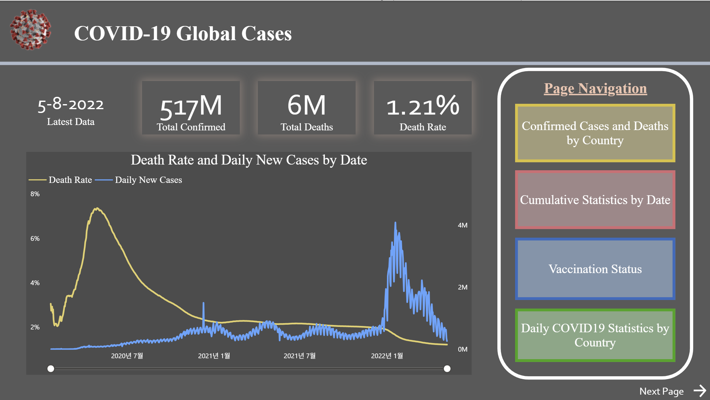
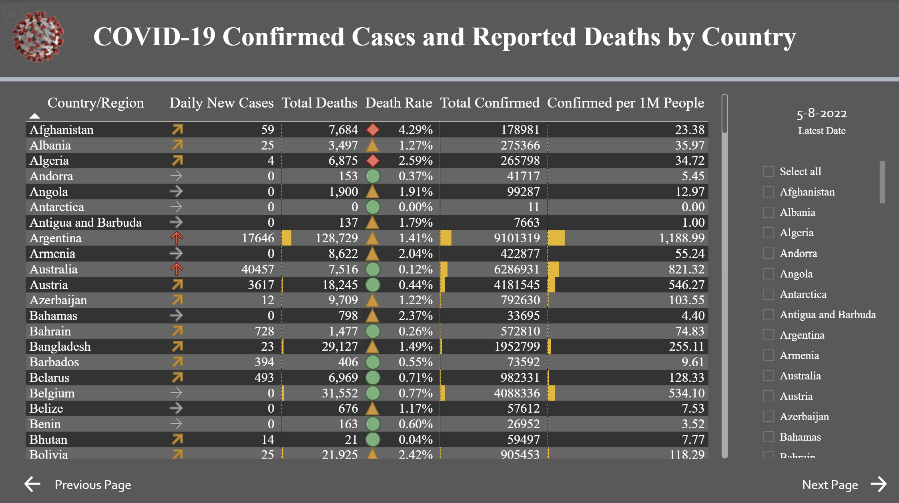
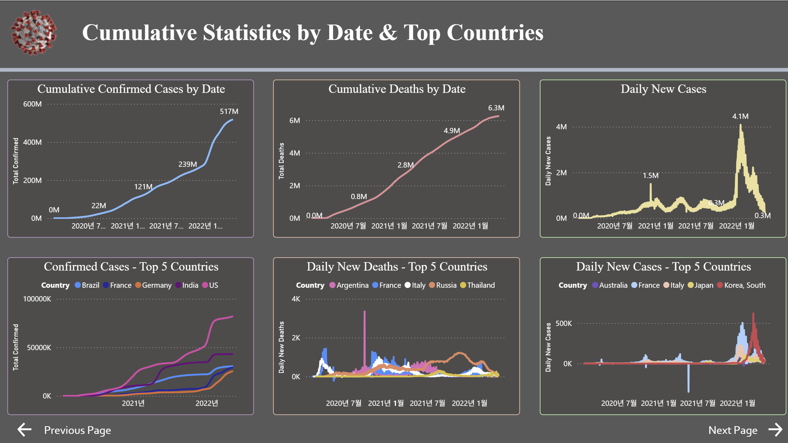
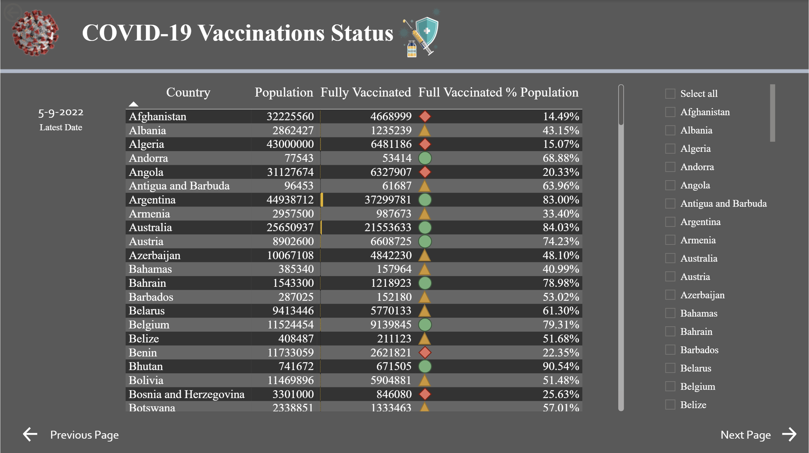
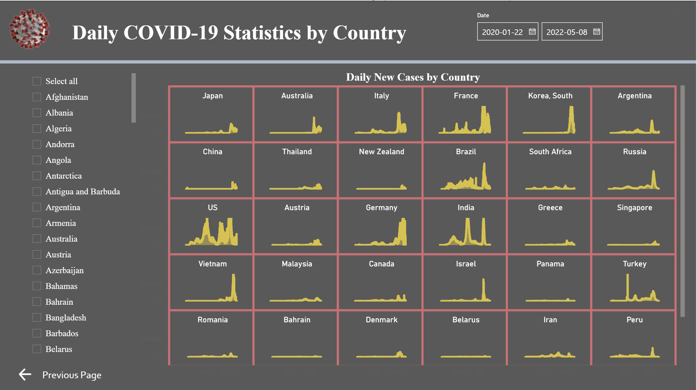

# 🌍 COVID-19 Global Dashboard with Power BI

This project presents an interactive Power BI report visualizing global COVID-19 statistics using public data from [USA Facts](https://usafacts.org/visualizations/coronavirus-covid-19-spread-map/).

## 📊 Dashboard Overview

The Power BI report includes the following pages:

- **Global Summary**: Total confirmed cases, deaths, and death rates with trend charts.
- **Confirmed Cases and Deaths by Country**: Sortable tables and KPIs per country.
- **Cumulative Statistics by Date**: Trends for total confirmed/deaths and daily cases by top countries.
- **Vaccination Status**: Percentage of population vaccinated by country.
- **Daily COVID-19 Statistics by Country**: Small multiple charts for each country's daily new case trends.

## 📸 Screenshots

### 🔹 Global Summary

### 🔹 Confirmed Cases by Country

### 🔹 Cumulative Statistics

### 🔹 Vaccination Status

### 🔹 Daily Trends by Country

## 🗂️ Dataset Source

- [USA Facts COVID-19 Tracker](https://usafacts.org/visualizations/coronavirus-covid-19-spread-map/)
- Data includes daily counts of confirmed cases, deaths, and vaccinations.

---
